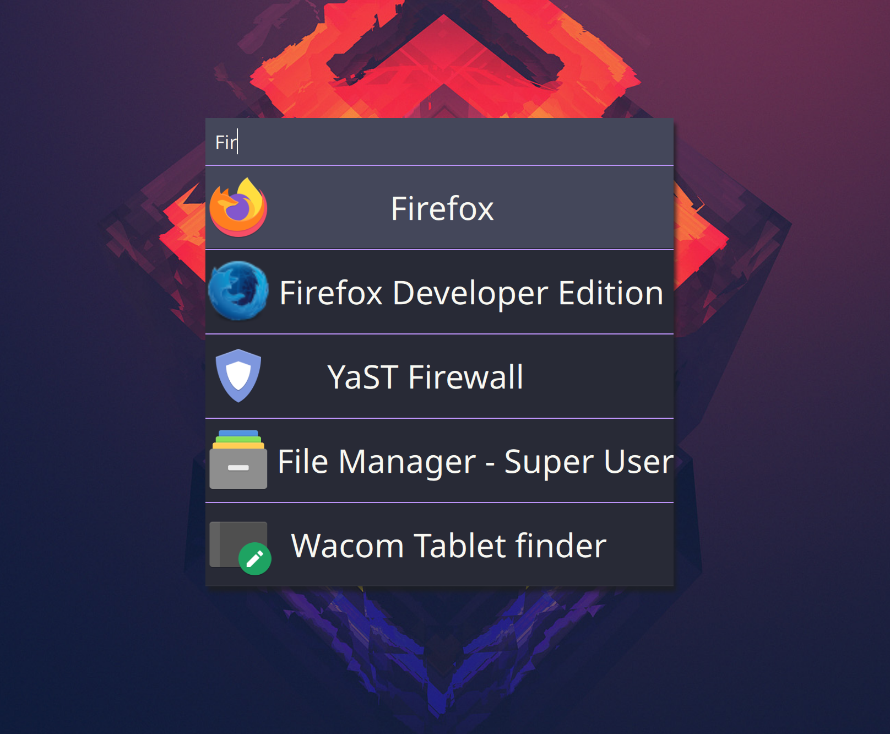

# Poki Launcher

This is primarily developed over here https://git.sr.ht/~zethra/poki-launcher.  I'll still accept PRs and
issues on github but the code here might not be up to date.  I'll try to remember to at least post releases here.

**Work in progress**

Poki Launcher is an application launcher for Linux.  It tracks app usage then ranks apps based on frecency and fuzzy search.
It's written in Rust and QML.  I mostly made this for myself but if anyone else finds some use for it that'd be great.



# How to Install

## OpenSUSE & Fedora

Get package from OBS: https://software.opensuse.org//download.html?project=home%3Azethra&package=poki-launcher

### Features

- Sorts apps by how recently and how frequently you use them producing good results with minimal input
- Using the same fuzzy search algorithm an fzf to sort apps
- Automatically detects new apps
- i3/tiling wm compatible


## From Source

Install the Qt5 base and declarative development packages for your distro.
Ex.
Fedora `dnf install qt5-qtbase-devel qt5-qtdeclarative-devel`
OpenSUSE `libqt5-qtbase-devel libqt5-qtdeclarative-devel`

Also install `wmctrl`

```
git clone https://github.com/zethra/poki-launcher.git && cd poki-launcher
cargo install --path poki-launcher
```

# Configuration

To change any setting in the app copy the example config file installed
at `/usr/share/doc/packages/poki-launcher/poki-launcher.hjson` if installed
from the package other grab it from `https://raw.githubusercontent.com/zethra/poki-launcher/master/poki-launcher.hjson`.
Copy this file to `~/.config/poki-launcher/poki-launcher.hjson`.

## Config Options

The list of config options and their defaults are in the example
config file [poki-launcher.hjson](./poki-launcher.hjson)


# Trouble Shotting

**Q** An app isn't in the list

**A** If the app's desktop file is in a directory that's
not in the `app_paths` list in the config file they won't
show up.  If the app was installed with flatpak or snap
uncomment the lines for those in the example config file.

## Otherwise

If you have any issues with the app or a question send me and email
detailing the issue at [benaagoldberg@gmail.com](mailto:benaagoldberg@gmail.com) with "POKI LAUNCHER ISSUE"
in the subject line or create an issue on my github page.
